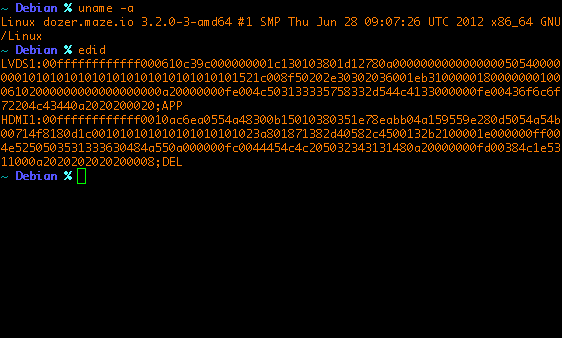

EDID
====

Extracts extended display identification data information using the RandR
extension. Useful in identifying what monitor is connected to your system.

Requirements
============

You need a compiler and the RandR extensions enabled, version 1.3 of the RandR
extension is required.

To find out if RandR is enabled, simply call <code>xrandr<code> (from
<code>x11-xserver-utils</code> in Debian) or grep for RANDR in your X.Org
server log (usually somewhere in <code>/var/log/Xorg.0.log</code>).

If RandR is not yet enabled in xorg, you can enable it by adding:

    Section "ServerFlags"
        Option "RandR" "on"
    EndSection

Compiling
=========

Simply call <code>make</code>

Example
=======

I have a Dell monitor connected to my MacBook Pro:

